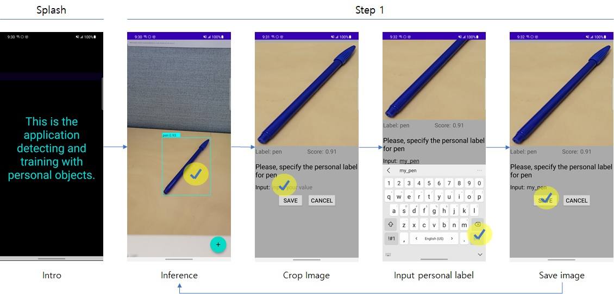
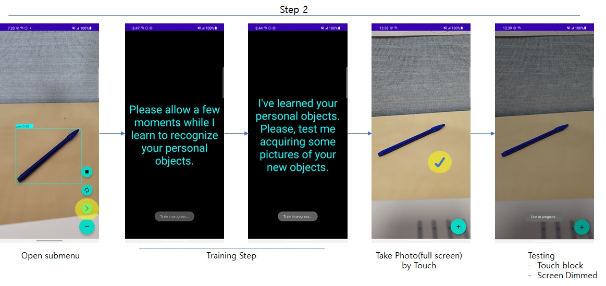
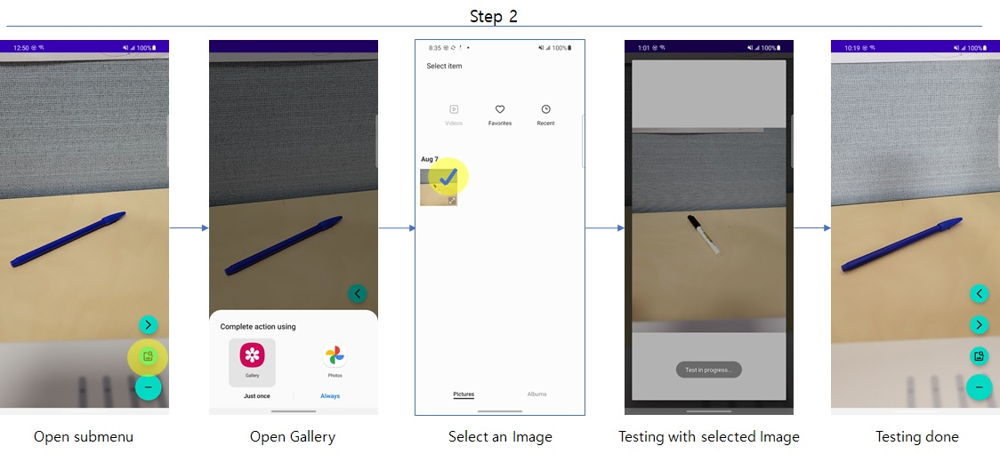
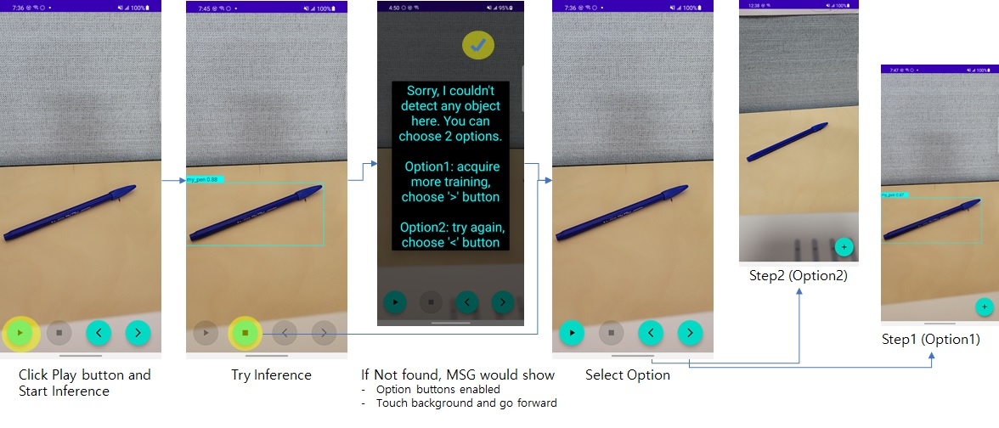
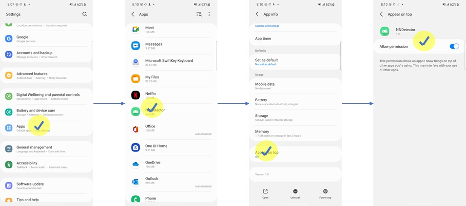

# NNDetector
NNDetector based on nntrainer is an demo application conducting object detection.
You can inference an object and train with your personal items. Below is showing how to detect and train with NNDetector.

# How To Build
Build nntrainer
~~~
$cd {$NNTRAINER_HOME}
$./tools/package_android.sh
~~~

Build Continual Learning Module
~~~
$cd {$APP_HOME}/app/src/main/jni
$./prepare_android_deps.sh
~~~

Build and Install App
~~~
$./gradlew build
$adb install app/build/outputs/apk/debug/app-debug.apk
~~~
or
~~~
$./gradlew installDebug
~~~

# How To Use
## Inference and data collecting

## Train and Test
### Train and Test with camera

### Test with Image file on Device

## Inference and Retry

# Troubleshooting
Crash can come out when you touch screen at Test Phase. Then you need to set "appear on top" on the setting of application.

