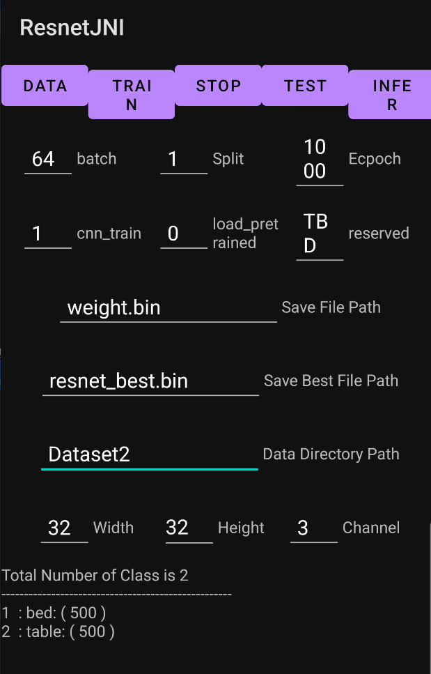

# STEP for training

## 1. Prepare data

1. Check `Data Direct Path`
2. Click `DATA` button

In this step, training dataset in `assets` is copyed to file space for this application.

## 2. Strart train.

1. Check hyperparameters (batch, split, epoch, cnn_train, load_pretrained)

- cnn_train:
  + `1` : enable trainning cnn layers
  + `other` : diable training cnn layers (only training fcl layer-for transfer learning) 

- load_pretrained:
  + `1` : load prebious trained model before training (loading target is hardcode as `weight.bin`)
  + `other` : training with default random weights

2. Click "TRAIN" button

During traininging, training data is `{Data Directory Path}/train` and validation data is `{Data Directory Path}/test`.

# STEP for testing

## 1. Prepare data

1. Check `Data Direct Path`
2. Click `DATA` button

In this step, training dataset in `assets` is copyed to file space for this application.

## 2. Strart test.

1. Click "TEST" button
For testing, the model is loaded from `Save Best File Path`, and it will use the data at `{Data Directory Path}/evaluate`

